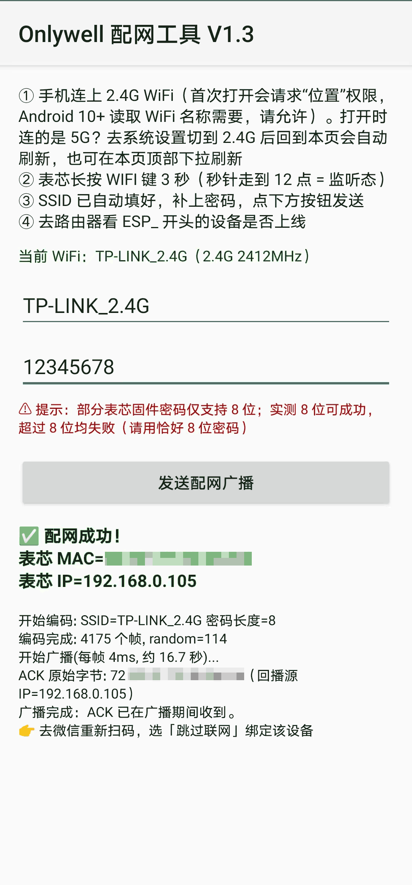
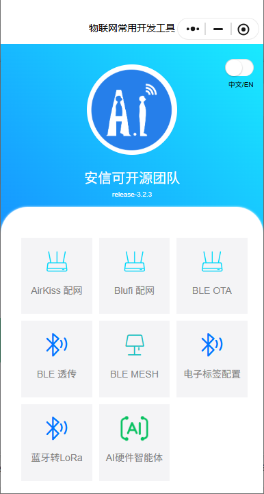
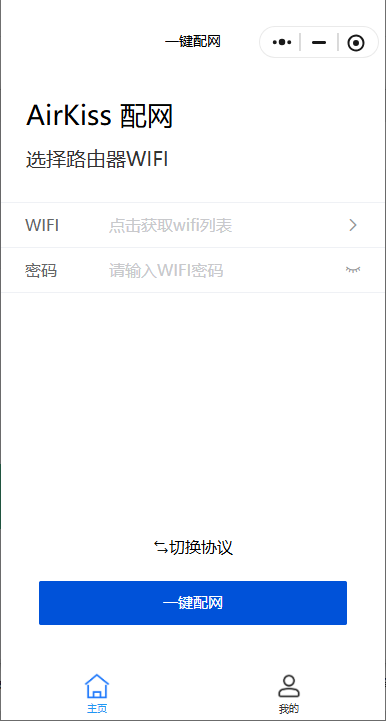

# Onlywell Airkiss 配网工具

Onlywell 表芯WIFI 石英钟（ESP 模组）**解绑微信后 Airkiss 配网失效**的离线自救工具。

## 背景

Onlywell 是微信生态 ESP 设备，配网走 **Airkiss** 协议。微信解绑后，微信内 Airkiss 下发环节
失效（表现为"连接中"一直转圈、手机不发包）。本工具用**标准 Airkiss 协议**直接驱动网卡把
`SSID + 密码`编码进 UDP 广播帧长度打出去，绕过微信，让表芯重新联网走时。

> ⚠️ `EspTouch` 不行——它发的是 Espressif **SmartConfig** 包，表芯解不出。必须用 Airkiss。

## 三种用法（由简到繁）

1. **微信小程序（最简单）**：微信搜索「**一键配网**」或「**安信可 IoT**」小程序 → 选 **AirKiss 配网** → 连 **2.4G** WiFi → 填密码 → 点「一键配网」→ **同时表芯长按 WIFI 键 3 秒，让秒针停在 12 点（监听态）**。
   - 这两个小程序均内置标准 Airkiss 协议，无需安装 App，是最快捷的配网方式。
2. **本仓库 APK（推荐）**：安装 [`OnlywellAirkiss-Config-v1.1.apk`](https://github.com/hevents/onlywell-airkiss-config/releases/download/v1.1/OnlywellAirkiss-Config-v1.1.apk)（点链接直接下载；或到 [Releases 页](https://github.com/hevents/onlywell-airkiss-config/releases) 查看）→ 连 **2.4G** WiFi（App 会自动填 SSID，连 5G 会警告）→
   填密码（明文显示，方便核对） → 点「发送配网广播」→ **同时表芯长按 WIFI 键 3 秒，让秒针停在 12 点（监听态）** →
   App 监听到表芯回播即显示「✅ 配网成功！设备 MAC=… IP=…」，随后在微信里重扫设备二维码选「跳过联网」重新绑定。
   - 未收到回播：多为表芯**未处于监听态**，请重新发送配网广播（先长按表芯进监听、再立即点发送）。
3. **电脑**：PC 连同一 2.4G WiFi，运行：
  ```bash
  python airkiss_sender.py --ssid <你的WiFi名> --password <密码>
  ```

## 界面预览

- **本仓库 APK 界面（v1.1）**：

  

- **微信小程序 · 安信可 IoT 配网界面**：

  

- **微信小程序 · 一键配网界面**：

  

## 手机端工作原理（v1.1）

1. 把 `SSID + 密码` 按 Airkiss 编码成约 4175 个广播帧，循环重发（每帧约 4ms，单遍约 16.7s）。
2. 表芯在监听态下嗅探到足够帧数即解出密码并联网。**Onlywell 表芯联网后会向手机 `:10000` 回播
   `random(1B) + MAC(6B)`**——App 据此判定配网成功并显示设备 MAC（= 路由 DHCP 里 `ESP_` 设备的 MAC）。
3. 回播一收到即**立即**给出绿色成功提示，无需等待整段广播跑完。
4. 每次重发前自动清空上一轮日志，避免多轮结果混淆。
5. 同时显示回播包的**源 IP 地址**（UDP 包 IP 头源地址，即设备发包所用地址，
   实测确认与路由 DHCP 分配给表芯的 LAN IP 一致，原理与安信可 IoT 小程序显示 IP 相同）。
6. 密码输入框**明文显示**，输入时可直接核对，避免因看不清输错导致配网失败。
7. 发送侧若 `255.255.255.255` 全 1 广播被内核拒绝（`EPERM`），自动切换为**子网定向广播**（本机 IP 末段置 255）兜底，无需重启手机；监听 socket 在 `finally` 中保证关闭，不会泄漏占用端口 10000。
8. 端口 10000 被占用（`EADDRINUSE`）时给出明确引导：若强制停止本应用后仍占用，说明占用者是微信/安信可IoT 等**别的配网应用**（同样用 10000 收设备回播），去强制停止对应应用或等约 35 秒即可；广播不受影响，仍可在路由器侧确认 `ESP_` 设备上线。
9. **密码长度提示**（密码框下方红字）：部分表芯固件密码仅支持 **8 位**；实测 8 位可成功、超过 8 位均失败（疑为设备 Airkiss 接收缓冲上限，非协议限制亦非本工具编码问题，请用恰好 8 位密码）。
10. **WiFi 刷新（v1.1 新增）**：打开时连的是 5G？去系统设置切到 2.4G 后回到应用即**自动刷新**当前 WiFi（SSID + 频段提示同步更新）；在页面上部**下拉**也可手动刷新。手动改过 SSID 输入框则刷新不覆盖用户输入，只更新频段提示行。

> 实测确认：onlywell 表芯配网成功**必会回播**，未收到回播基本是表芯没在监听窗口内。

## 源码结构

| 路径 | 说明 |
|---|---|
| `airkiss_app/` | Android 工程（Java）。`build_apk.sh` 可重编译 APK（需 Android SDK build-tools 34 + platforms;android-34） |
| `airkiss_app/AndroidManifest.xml` | 权限与版本声明 |
| `airkiss_app/src/com/onlywell/airkiss/AirKissEncoder.java` | Airkiss 帧编码（基于微信公开协议规范实现，参考 `zhchbin/WeChatAirKiss` 校验，含 CRC8） |
| `airkiss_app/src/com/onlywell/airkiss/MainActivity.java` | UI + 发送循环 + 2.4G/5G 检测 + 进度条 + ACK 回播监听 |
| `airkiss_app/res/layout/activity_main.xml` | 界面布局 |
| `airkiss_app/res/values/strings.xml` | 文案 |
| `airkiss_sender.py` | PC 端 Python 配网脚本（仅标准库，零依赖） |
| `airkiss_sender_说明.md` | PC 端详细说明与排错 |
| `decode_qr.py` / `decode_qr2.py` | 设备绑定二维码解码辅助脚本（带中心 logo 的二维码多预处理尝试） |

## 构建

```bash
bash airkiss_app/build_apk.sh
```

## 致谢与参考

- 本工具的 Airkiss 帧编码（CRC8、magic/prefix/sequence 结构）依据**微信硬件平台公开的 Airkiss 协议规范**实现；开发时对照 [zhchbin/WeChatAirKiss](https://github.com/zhchbin/WeChatAirKiss)（Java 参考实现）逐位校验编码逻辑，特此致谢。
- 说明：zhchbin/WeChatAirKiss 仓库未声明开源许可证。本仓库代码为基于上述协议规范的**独立实现**，仅以其作为实现参考，未直接复制其源码。

## 隐私

本仓库所有具体 MAC / IP / WiFi 名 / 密码均已匿名化，可安全分享。
